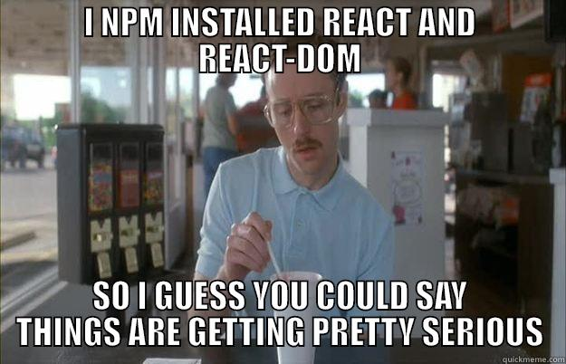

# Fast React Pizza Co. 🍕🧾

This is a project created by Jonas Schmedtmann for his UDEMY course 'The Ultimate React Course 2023: React, Redux & More'

## The App

This application marks the inaugural project within the course, serving as an initial foray into the world of React development. Designed as a rudimentary web application emulating a pizza company, it showcases a straightforward menu presentation, complete with pizza listings featuring detailed descriptions and corresponding prices.

## Goals 🌐

The primary objective of this small project was to gain a foundational grasp of React's core concepts, encompassing **JSX** for defining **components**, the seamless transmission of data through **props**, and the adept utilization of the ternary operator to **conditionally render information**.

💙 Having worked with React in the past, I was already acquainted with these concepts. Nonetheless, this project served as a helpful refresher on React's fundamentals and rekindled my enthusiasm for the framework. I can't wait to build upon these skills and create more complex applications in the future.

 

